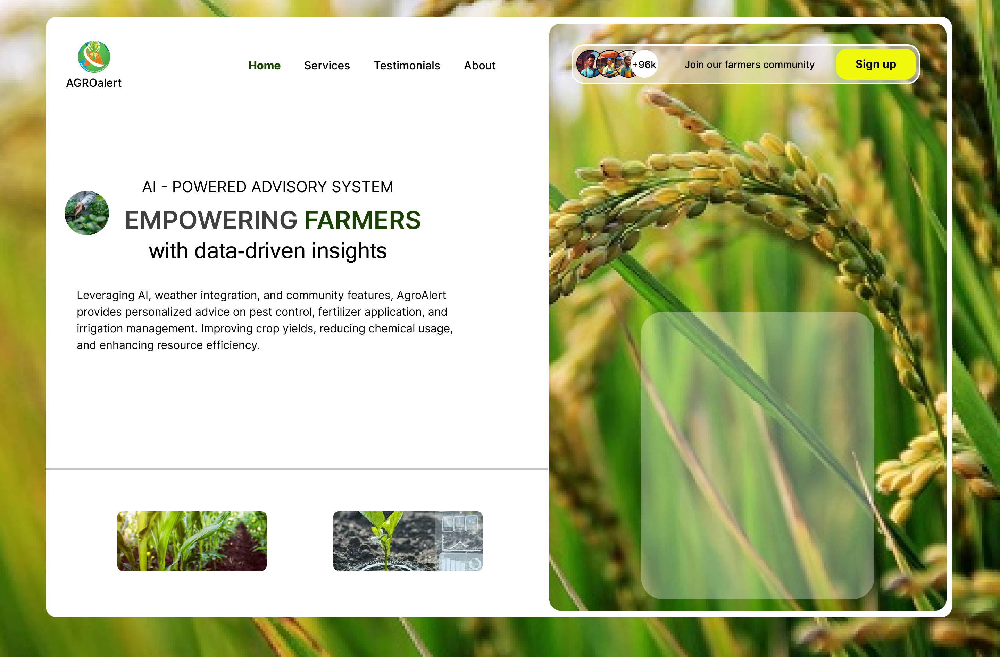

# AGROalert

AgroAlert is a web-based crop monitoring and advisory system empowering farmers with data-driven insights. Leveraging AI, weather integration, and community features, AgroAlert provides personalized advice on pest control, fertilizer application, and irrigation management. Improving crop yields, reducing chemical usage, and enhancing resource efficiency.

 

## Table of contents

- [Overview](#overview)
  - [The challenge](#the-challenge)
  - [Screenshot](#screenshot)
  - [Links](#links)
- [Dev process](#my-process)
  - [Built with](#built-with)
  - [What we learned](#what-i-learned)
  - [Continued development](#continued-development)
  - [Useful resources](#useful-resources)
- [Author](#author)
- [Acknowledgments](#acknowledgments)

## Overview

### The challenge

Users should be able to:

- Accurately identify and manage crop diseases
- Access to reliable and timely weather forecasts
- Get knowledge and skills in pest control, fertilizer application, and irrigation management
- Recieve tips on use of resources, in other to mitigate waste and increase productivity

### Screenshot

### Links

- Design Url: https://www.figma.com/design/tyvYhEmOgvSQcEASCHkLge/AGROalert?node-id=0-1&t=AHBORNm1BiKn2XxP-1
- Solution URL: https://github.com/mcquest72/AGROalert 
- Live Site URL: 

## Dev process

### Built with

- HTML
- CSS
- Bootstrap
- JAVASCRIPT
- SQL
- PYTHON 

### What we learned

### Continued development

We shall love to continue focusing on responsive design and security of this solution in future projects. We hope that users data will protected and they could be able to have a seemless experience working with our solution.

### Useful resources

- [w3school](https://www.w3schools.com/) - This helped us gain some insight to the structure of html, css, and javascript. We hope to continue using this platform going forward.

## Contributors

- Kumaga Senenge  - [GitHub](https://github.com/Beacon-Tek)
- Chicha Msughter Jerry - [GitHub](https://github.com/mcquest72)
- David Kunde - [GitHub](https://github.com/David-Kunde)
- Saaondo Jacob Ushahemba - [GitHub](https://github.com/saaondojacob) 
- IEREN USHAHEMBA ISAAC - [GitHub](https://github.com/iushahemba170)

## Acknowledgments

Our sincere appreciation goes to our digital Governor, His Execellency, Rev Fr. Dr. Hycinth Iormem Alia, for this wonderful opportunity to leaverage this tech skills. May God bless you sir.

We wish to also thank our mentors [@katfogy](https://github.com/katfogy), and [@giftednathan](https://github.com/giftednathan) for their guidance and support without which we wouldn't have come this far. We appreciate you.
